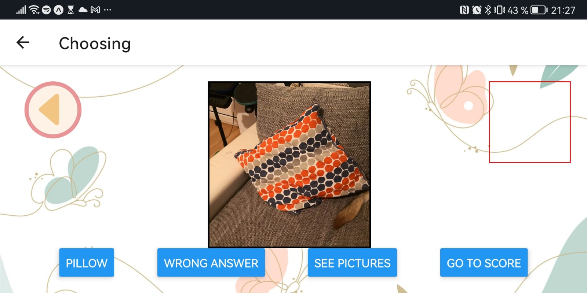
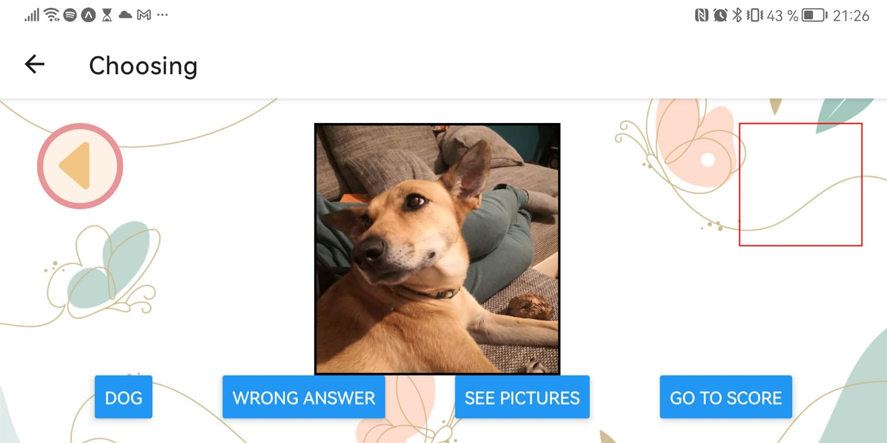

# v41-bears-team-29
What's that?!

A app game for kids that helps them increase their vocabulary by recognizing objects around their house.
the user can use the camera of his device to take a photo of an object, he will have 3 options to choose the correct name of the object 
recognized by the photo thanks to AI one of the options will be the correct answer.
[See the demo](https://vimeo.com/770288713)

Some tries:

